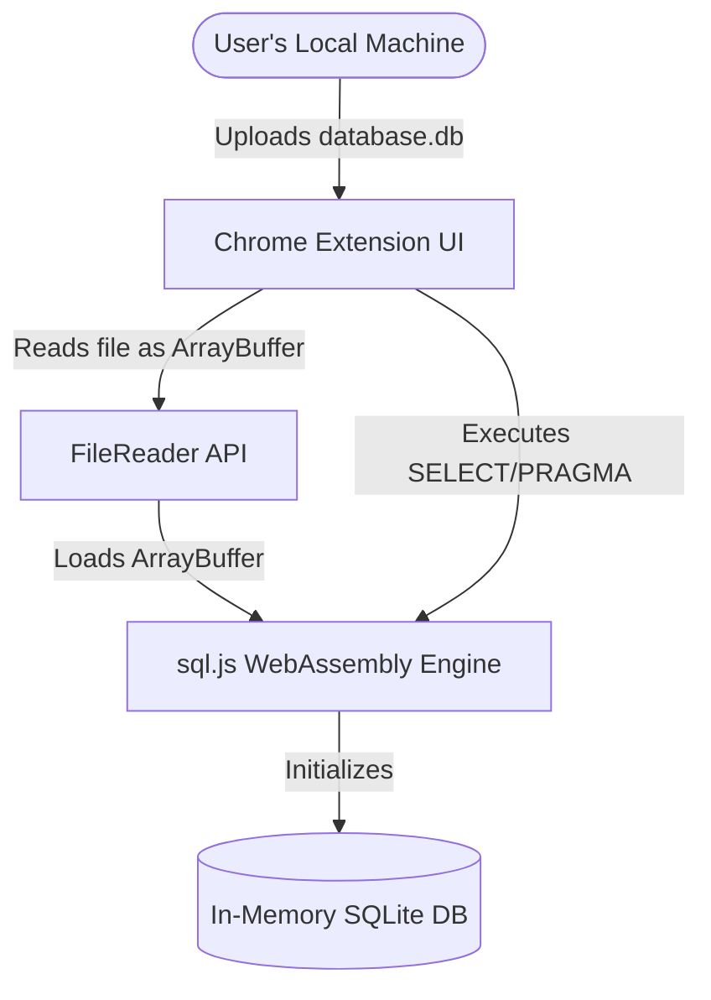

# InsightDB Client Companion (Chrome Extension Blueprint)

This directory contains the Chrome Extension blueprint for **InsightDB**, enabling 100% private, serverless, offline client-side execution. By utilizing WebAssembly (`sql.js`), databases can be uploaded and audited directly inside the browser's sandbox without ever transmitting data to an external server.

---

## Architecture Design



---

## File Structure

- `manifest.json`: Defines the Extension Metadata, Permissions (ActiveTab, Storage), and declares Manifest V3 compliance.
- `popup.html`: Premium dark-themed UI that mirrors the InsightDB web experience.
- `popup.js`: Script to read the binary SQLite database using HTML5 FileReader and load it into the SQL engine.

---

## Bundle Instructions (For Production Launch)

To achieve 100% serverless query execution, the extension needs the official `sql.js` WebAssembly bundle:

1. **Download `sql.js` Files**:
   - Go to the official [sql.js GitHub repository Releases](https://github.com/sql-js/sql.js) or install it via npm:
     ```bash
     npm install sql.js
     ```
2. **Copy to this Directory**:
   - Copy `sql-wasm.js` (the JavaScript binder) and `sql-wasm.wasm` (the WebAssembly binary) into this `chrome-extension/` folder.
3. **Include the Script**:
   - Update `popup.html` to include `<script src="sql-wasm.js"></script>` right before `<script src="popup.js"></script>`.

---

## Installing in Chrome

1. Open Google Chrome and navigate to `chrome://extensions/`.
2. Enable **Developer Mode** by toggling the switch in the top-right corner.
3. Click the **Load unpacked** button in the top-left.
4. Select the `chrome-extension/` directory of this project.
5. The **InsightDB Client Companion** icon will now appear in your extension toolbar! Pin it and click to start.

---

## Security & Compliance Advantage

- **Zero Data Leakage**: Highly confidential corporate databases are audited completely inside active browser RAM. No records are sent over HTTP.
- **Permanent Availability**: Works 100% offline, regardless of network connectivity or remote API server health.
- **Standard-Compliant Sandbox**: Restricts operations entirely to the current window, aligning with strict enterprise data protection policies.
